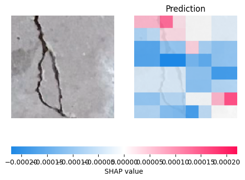

# 🧠 Explainable AI for Crack Detection in Reinforced Concrete: A Post-Hoc Approach Combining XAI Techniques in Convolutional Neural Networks

This repository contains the source code and experiments related to the paper:  
**_"Explainable AI for Crack Detection in Reinforced Concrete: A Post-Hoc Approach Combining XAI Techniques in Convolutional Neural Networks"_**  

---

## 📋 Summary

This project proposes a new method to make convolutional neural networks (CNNs) more interpretable for detecting cracks in concrete structures. The approach combines:

- **Grad-CAM with automatic selection of convolutional layers**
- **Segmentation using K-means**

Using the **VGG19 architecture with transfer learning**, the model achieved over **99% accuracy** on both training and test datasets. Civil engineers participated in validating the interpretability of the results, confirming its practical relevance.

---

## 🧪 Requirements

### Language and Libraries
This project was developed using **Python 3.12** with the following main libraries:

```bash
tensorflow==2.2.0
keras==2.3.0.0
opencv-python
scikit-learn
matplotlib
pandas
numpy
shap
Pillow
h5py
```

## 🧠 Dataset

- Dataset name: Concrete Crack Images for Classification
- Reference: Özgenel, Ç.F.: Concrete crack images for classification. Mendeley Data 2, 2019.
- Source: https://data.mendeley.com/datasets/5y9wdsg2zt/2

The dataset used for this study is the "Concrete Crack Images for Classification". The dataset consists of images of cracking concrete surfaces collected from
various buildings on the METU campus.
The data is divided into two categories: cracked (positive) and non-cracked
(negative) images for classification purposes. Each category contains 20,000 im-
ages, making a total of 40,000 images, all with a resolution of 227 x 227 pixels
and RGB channels.


## 📊 Expected Results

### Proposed Model Evoluation - VGG19
The VGG19 architecture with transfer learning achieved the best performance in the binary classification of cracks in concrete images.

The results demonstrate the robustness of the model, achieving 99.87\% accuracy on the training set and over 99.2\% on the validation set. When evaluated on the test set, the model maintained its consistency, reaching 99.61\% accuracy with a loss of 0.0221. The classification report highlights near-perfect precision and recall for both classes, confirming the model's ability to reliably distinguish cracks


#### Others Methods Evoluation

#### VGG 16 
Teste accuracy: 99%


#### Resnet 50
Teste accuracy: 94%


### Proposed Method Evoluation - Grad_CAM (Model - VGG19)

#### Proposed Method Overview


In terms of performance, the F1 metric results show that the model performed satisfactorily overall, with a mean of 0.65 and high variability (standard deviation = 0.2363). However, when we focused only on the class containing cracks, the model's performance was significantly better, with a mean of 0.7511, lower dispersion (std = 0.2127), and a median of 0.8198, indicating that most segmentations were successful. On the downside, a few lower outliers were identified, with F1 scores below 0.3, suggesting that in some cases, the segmentation was less precise. These results show that while the model performed well overall, it can struggle with more complex images, highlighting the need for adjustments to improve segmentation in more challenging situations.

#### Illustration of the process for explaining and segmenting concrete cracks.


### Others Methods Evoluation (Model - VGG19)

#### Others Methods Overview


The SHAP-based method, which was also applied to explain the model's decisions, demonstrated significantly lower performance in identifying the relevant crack regions. The mean F1-score was 0.2477 with a high standard deviation of 0.2357. Moreover, the median F1-score was only 0.1909, and 25\% of the samples scored below 0.0396, indicating poor explanatory alignment in a large portion of cases. Although the maximum value reached 0.9417 in some specific examples, the wide variability and low central tendency suggest that SHAP struggles to provide consistent and spatially precise explanations in the context of crack segmentation.

The LIME method exhibited stable and consistent performance in explaining the model's decisions, with a mean F1 score of 0.1947 and a median of 0.2289. Although these results are not outstanding, LIME demonstrated its strength in delivering more balanced explanations, as evidenced by a lower standard deviation of 0.0948, in contrast to SHAP, which showed significant variability in its results.

#### Exemplo of Shap Output


#### Exemplo of Lime Output


These findings reinforce that pixel-perturbation-based methods, which treat the model as a black box, tend to produce less reliable and spatially less coherent explanations when compared to gradient-based approaches. In contrast, the proposed method, grounded in Grad-CAM and automatic layer selection, demonstrated substantially superior performance, especially for the crack class (mean F1 = 0.7511), indicating a greater ability to localize and highlight discriminative regions. This result underscores the importance of leveraging the model's internal information to generate more faithful and interpretable visual explanations in CNN-based image classification tasks.

---

## 🤝 Contributing

The key scientific contributions arising from this
study include: an analysis of the effectiveness of XAI methods in interpreting and
explaining the predictions of computer vision models, the introduction of hybrid
methods that enhance the explainability of artificial intelligence models applied
to civil engineering, and the use of metrics to assess the quality and effectiveness
of the explanations provided by XAI methods in image classification.
